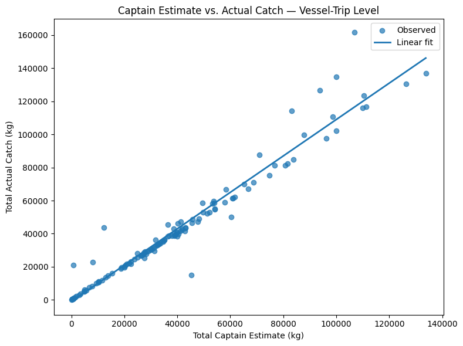
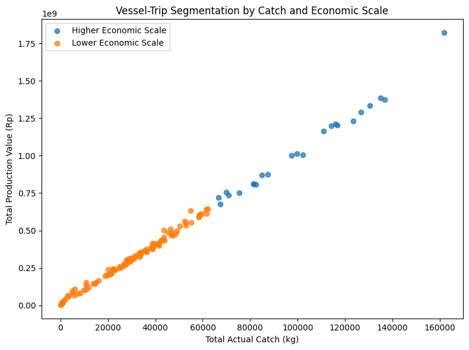
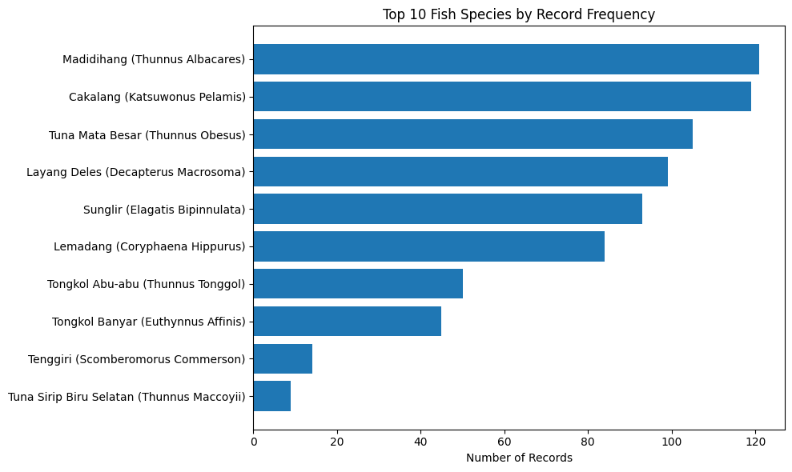
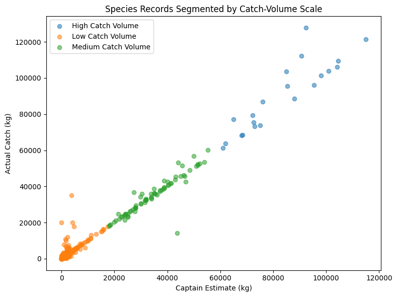

# Fisheries Operational Analytics — PHPP Data

[](https://www.python.org/)
[](https://pandas.pydata.org/)
[](https://scikit-learn.org/)
[](https://jupyter.org/)

Operational fisheries analytics project using real-world **Post-Production Fisheries Levy (PHPP)** records from **PT. Daya Bahari Nusantara**, covering vessel activity, catch estimation, production value, fisheries levies, species composition, and K-Means segmentation.

## Project Overview

This project was developed as part of my **Practical Work course in Data Science** using operational data from **PT. Daya Bahari Nusantara**.

Unlike a typical public or classroom dataset, the source data was manually compiled from company operational documents, including **Clearance In** and **Clearance Out** records, before being structured into an analytical dataset.

The objective of the project was to transform these operational records into useful analytical insights related to:

- vessel and company activity;
- fishing-gear usage;
- captain-estimated versus recorded catch;
- fisheries production value;
- PHPP levy patterns;
- fish-species composition; and
- operational segmentation using unsupervised learning.

The analysis is performed at two different levels:

1. **Vessel-trip level** — multiple fish-species records from the same trip are aggregated into a single operational trip.
2. **Species-record level** — each record represents a fish species documented within an operational trip.

## Dataset

The original dataset contains:

| Dataset Characteristic | Value |
|---|---:|
| Original observations | **777** |
| Original variables | **12** |
| Vessel-trip records after aggregation | **133** |
| Companies | **12** |
| Vessels | **26** |
| Fishing-gear categories | **3** |
| Fish species | **24** |

The dataset contains operational information such as:

- company
- vessel
- vessel size (GT)
- departure date
- arrival date
- fishing gear
- fish species
- captain-estimated catch
- recorded actual catch
- reference fish price
- production value
- PHPP levy

## Analytical Workflow

```text
Operational Documents
        │
        ▼
Manual Data Collection
        │
        ▼
Raw Excel Dataset
        │
        ▼
Data Quality Inspection
        │
        ▼
Date Standardization
        │
        ▼
Categorical Encoding
        │
        ▼
Analytical Grain Design
     ┌──┴─────────────┐
     ▼                ▼
Vessel-Trip        Species-Level
Analysis           Analysis
     │                │
     ▼                ▼
Operational EDA    Catch Analysis
Regression         Regression
K-Means            K-Means
Segmentation       Segmentation
```

## Data Preprocessing

The preprocessing stage prepares the manually collected operational records for consistent downstream analysis.

The workflow includes:

1. loading the original Excel dataset;
2. inspecting dataset structure and data quality;
3. validating missing values and duplicate observations;
4. standardizing departure and arrival dates into `datetime`;
5. encoding categorical variables;
6. preserving category mappings for interpretability; and
7. exporting the processed dataset for the main analytical workflow.

The categorical variables include:

- company;
- vessel;
- fishing gear; and
- fish species.

Encoded categorical values are treated strictly as **category identifiers**, not ordinal measurements. Therefore, their numerical codes are not used as continuous variables in correlation or regression analysis.

The complete preprocessing workflow is available in:

```text
notebooks/01_data_preprocessing_portfolio.ipynb
```

## Vessel-Trip Analysis

The original dataset contains multiple fish-species observations for the same vessel trip.

To avoid over-counting operational activity, species-level records belonging to the same trip were aggregated into **133 unique vessel-trip records**.

This analytical grain was used to examine:

- company activity;
- vessel activity;
- vessel size;
- fishing-gear distribution;
- departure and arrival patterns;
- captain-estimated catch;
- recorded actual catch;
- production value;
- PHPP levy; and
- operational segmentation.

### Company and Vessel Activity

The vessel-trip dataset covers:

- **12 companies**
- **26 vessels**
- **3 fishing-gear categories**

The three most active companies account for approximately **62.41% of all vessel-trip records**, indicating that operational activity in the dataset is relatively concentrated among several companies.

At vessel level, the analysis also identifies vessels with the highest number of recorded trips during the observed period.

### Fishing Gear Distribution

The dataset contains three fishing-gear categories.

Among the recorded vessel trips, **Pukat Cincin Pelagis Besar** appears most frequently.

This analysis provides an overview of the fishing methods represented in the operational records rather than evaluating their productivity or efficiency.

## Captain Estimate vs. Actual Catch

One important operational question in the dataset is how closely the captain's estimated catch corresponds to the subsequently recorded actual catch.

A descriptive linear regression was used to examine this relationship at vessel-trip level.

The analysis produced approximately:

- **R² = 0.947**
- **Regression slope = 1.10**

The high R² indicates that captain-estimated catch and recorded actual catch move very closely together across vessel trips.

This suggests that captain estimates provide a strong approximation of the final recorded catch volume within the observed operational data.



> The regression is used to describe the observed relationship between the two variables and should not be interpreted as evidence of causality.

## Vessel-Trip Segmentation

K-Means clustering was applied to identify groups of vessel trips with different operational and economic scales.

The clustering features were:

- total actual catch volume;
- PHPP levy amount; and
- total production value.

Because these operational variables contain valid high-value observations and skewed distributions, **RobustScaler** was applied before clustering.

Several values of `k` were evaluated using the **Silhouette Score**.

The best tested configuration was:

| Metric | Result |
|---|---:|
| Number of clusters | **2** |
| Silhouette Score | **≈ 0.665** |

The resulting groups are interpreted as:

- **Lower Economic Scale**
- **Higher Economic Scale**

These labels describe differences in the scale of recorded operations rather than differences in operational efficiency or business performance.



## Species-Level Analysis

While vessel-trip analysis aggregates multiple fish species into a single trip, the original **777 observations** are retained for species-level analysis.

This allows the project to examine:

- fish-species occurrence;
- estimated catch by species;
- actual catch by species;
- reference fish prices;
- production value; and
- catch-volume segmentation.

The species-level dataset covers **24 recorded fish species**.

## Fish Species by Catch Volume

Actual catch volume was aggregated by fish species to identify the species contributing the largest recorded catch volumes.

This view complements the vessel-level analysis by showing the composition of catch within the operational records.



The analysis focuses on recorded catch volume only. A high or low catch volume should not automatically be interpreted as an indicator of biological abundance, rarity, conservation status, or market importance.

## Captain Estimate vs. Actual Catch — Species Level

The relationship between captain-estimated catch and recorded actual catch was also evaluated for individual species records.

The species-level regression produced approximately:

- **R² = 0.978**
- **Regression slope = 1.05**

The relationship is even stronger than at vessel-trip level, indicating very close alignment between captain estimates and the actual catch recorded for individual fish species.

This provides additional evidence that estimated catch quantities in the operational documents generally track the final recorded values closely.

## Species Catch-Volume Segmentation

A second K-Means analysis was performed at species-record level.

The clustering features were:

- captain-estimated catch volume; and
- recorded actual catch volume.

As with the vessel-trip analysis, the variables were transformed using **RobustScaler** before clustering.

The best tested clustering configuration produced:

| Metric | Result |
|---|---:|
| Number of clusters | **3** |
| Silhouette Score | **≈ 0.894** |

The resulting segments were interpreted according to catch-volume magnitude:

- **Low Catch Volume**
- **Medium Catch Volume**
- **High Catch Volume**



The relatively high Silhouette Score indicates that the three catch-volume groups are well separated within the selected feature space.

These clusters describe differences in recorded catch magnitude only and do not imply differences in species quality, rarity, seasonality, or commercial value.

## Key Findings

Several important patterns emerged from the operational analysis:

- The original **777 species-level records** consolidate into **133 vessel-trip records** after accounting for multiple fish species within the same trip.
- The dataset represents **12 companies, 26 vessels, 3 fishing-gear categories, and 24 fish species**.
- The three most active companies account for approximately **62.41% of vessel-trip records**.
- **Pukat Cincin Pelagis Besar** is the most frequently recorded fishing gear within the vessel-trip dataset.
- Captain-estimated catch closely follows recorded actual catch:
  - **R² ≈ 0.947** at vessel-trip level.
  - **R² ≈ 0.978** at species-record level.
- Vessel-trip clustering identified **2 operational/economic-scale groups** with a Silhouette Score of approximately **0.665**.
- Species-level clustering identified **3 catch-volume groups** with a stronger Silhouette Score of approximately **0.894**.

Overall, the project shows that the operational records can support more than basic reporting. By restructuring the data into appropriate analytical grains, the dataset can be used for operational profiling, catch-estimation assessment, production analysis, and unsupervised segmentation.

## Tools & Techniques

### Programming and Data Processing

- Python
- Pandas
- NumPy
- Jupyter Notebook

### Data Visualization

- Matplotlib

### Statistical Analysis

- Descriptive statistics
- Distribution analysis
- IQR-based outlier diagnostics
- Spearman correlation
- Linear regression

### Machine Learning

- K-Means Clustering
- Silhouette Score
- RobustScaler

### Data Preparation

- Excel data ingestion
- Data-quality validation
- Datetime standardization
- Categorical encoding
- Data aggregation
- Analytical-grain transformation

## Repository Structure

```text
fisheries-operational-analytics/
│
├── assets/
│   ├── captain_estimate_vs_actual_catch.png
│   ├── species_catch_segmentation.png
│   ├── top_fish_species_by_catch.png
│   └── vessel_trip_segmentation.png
│
├── data/
│   ├── DataPHPP.xlsx
│   └── dataphpp2.csv
│
├── notebooks/
│   ├── 01_data_preprocessing_portfolio.ipynb
│   └── 02_phpp_operational_analytics_portfolio.ipynb
│
└── README.md
```

## Notebook Guide

### 1. Data Preprocessing

```text
notebooks/01_data_preprocessing_portfolio.ipynb
```

This notebook covers:

- loading the original operational dataset;
- inspecting dataset structure;
- checking data quality;
- standardizing date variables;
- encoding categorical variables;
- preserving category mappings; and
- exporting the processed dataset.

### 2. Operational Analytics

```text
notebooks/02_phpp_operational_analytics_portfolio.ipynb
```

This notebook contains the main analytical workflow, including:

- vessel-trip aggregation;
- company and vessel profiling;
- fishing-gear analysis;
- temporal operational analysis;
- catch-estimation analysis;
- production and PHPP analysis;
- species-level catch analysis;
- linear regression;
- K-Means clustering; and
- cluster interpretation.

## How to Run the Project

Clone the repository:

```bash
git clone https://github.com/widiearry/<repository-name>.git
cd <repository-name>
```

Install the main Python dependencies:

```bash
pip install pandas numpy matplotlib scipy scikit-learn openpyxl jupyter
```

Start Jupyter:

```bash
jupyter lab
```

Run the notebooks sequentially:

```text
1. notebooks/01_data_preprocessing_portfolio.ipynb
2. notebooks/02_phpp_operational_analytics_portfolio.ipynb
```

The preprocessing notebook generates the processed dataset used by the main analytical notebook.

## Methodological Notes

Several interpretation boundaries are maintained throughout the project.

### Categorical Encoding

Company, vessel, fishing-gear, and fish-species codes are nominal identifiers.

For example:

```text
Company 0
Company 1
Company 2
```

does not imply:

```text
Company 2 > Company 1 > Company 0
```

For this reason, encoded identifiers are excluded from numerical correlation and regression calculations.

### Operational Outliers

High catch volumes, production values, or levy values are not automatically removed.

In operational fisheries data, unusually large observations may represent valid large-scale fishing trips rather than data-entry errors.

### Regression Interpretation

Linear regression is used to quantify the observed relationship between estimated and actual catch.

The analysis is descriptive and does not establish a causal relationship.

### Cluster Interpretation

K-Means clustering identifies observations with similar numerical characteristics.

The vessel-trip clusters therefore represent differences in **economic and catch scale**, while the species clusters represent differences in **catch-volume magnitude**.

They should not automatically be interpreted as rankings of performance, efficiency, profitability, rarity, or biological importance.

## Project Scope

This analysis is based on operational records available during the practical-work project and therefore reflects the characteristics of the observed dataset.

The project does not attempt to:

- predict future fish catches;
- measure vessel profitability;
- evaluate fishing efficiency;
- estimate biological fish populations;
- assess sustainability or conservation status; or
- establish causal relationships between operational variables.

These questions would require additional data and a different analytical design.

## Portfolio Context

This project is particularly important in my portfolio because the analytical process began **before the data existed as a ready-to-use dataset**.

The workflow involved:

```text
Company Operational Documents
            ↓
Manual Data Collection
            ↓
Structured Raw Dataset
            ↓
Data Preprocessing
            ↓
Analytical-Grain Design
            ↓
Exploratory Data Analysis
            ↓
Descriptive Modeling
            ↓
K-Means Segmentation
            ↓
Business-Oriented Interpretation
```

Rather than beginning with a pre-cleaned public dataset, the project required transforming real operational documents into structured analytical data.

It demonstrates practical experience in:

- understanding business records;
- manually collecting and structuring data;
- validating data quality;
- defining the correct unit of analysis;
- translating operational questions into analytical workflows;
- applying statistical and machine-learning techniques; and
- communicating findings in a form that can be understood by non-technical stakeholders.

## Author

Built by [Ni Putu Widya Antary](https://github.com/widiearry).
